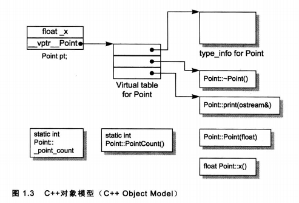

=======================
QEMU Object Model (QOM)
=======================

Revision
========

V1.0 Liao Chang:
    2021.11.15 创建文件，加入对object struct, class struct等机制的介绍。

这篇文档是一个QEMU设备模型开发的扫盲材料，关于QEMU Object Model的分析并不能保证
足够深入和细致，仅仅帮助团队快速理解QOM的相关基础知识。

+---------------+-------------------------------------------------------------+
| 名称          |   说明                                                      |
+===============+=============================================================+
| object struct | | 设备对象，对设备进行功能建模的概念，每个设备都会用struct  |
|               | | 对设备接口和功能进行建模。                                |
+---------------+-------------------------------------------------------------+
| class struct  | | 设备类型，每个设备对象必须有一个设备类型，这个设备类型既  |
|               | | 可以完全继承自父设备对象的类型，也可以是自定义的类型。    |
+---------------+-------------------------------------------------------------+

1. 声明设备对象(object struct)
==============================

**1.1 设备对象声明**

首先，QEMU不是一个简单的CPU模拟器，而是一个计算机模拟器，在QEMU的设计哲学里 
**`Everything in QOM is a device`** ，QEMU将所有硬件模块都当成一种Device，包括，
CPU，设备，接口，总线，内存，中断控制器，这些硬件模块在QEMU里都是通过一个特定struct实现:

CPU：

.. code-block:: c

    struct RISCVCPU {
        CPUState parent_obj;
        CPURISCVState env;
        ...
    }

..

中断控制器：

.. code-block:: c

    struct GICV3State {
        SysBusDevice parent_obj;
        GIC_DECLARE_BITMAP(group);        /* GICD_IGROUPR */
        GIC_DECLARE_BITMAP(grpmod);       /* GICD_IGRPMODR */
        GIC_DECLARE_BITMAP(enabled);      /* GICD_ISENABLER */
        GIC_DECLARE_BITMAP(pending);      /* GICD_ISPENDR */
        GIC_DECLARE_BITMAP(active);       /* GICD_ISACTIVER */
        GIC_DECLARE_BITMAP(level);        /* Current level */
        GIC_DECLARE_BITMAP(edge_trigger); /* GICD_ICFGR even bits */
        ...
    }
..

可以看到RISCVCPU结构体里包含了一个CPUState类型字段，GICV3State结构体里包含了一个
SysBusDevice类型字段，这两个类型又都包含一个struct DeviceState字段， **所以从逻辑上讲，
每个硬件对象都包含DeviceState类型对象，当构造一个RISCVCPU和GICV3State设备实例时，
天然就包含了一个DeviceState实例的属性** ，其实在QOM系统里，所有设备对象都是继承自struct Object，
这个Object是所有设备对象的基对象，开发中一般感知不到Object。

.. code-block:: c

    struct CPUState {
        DeviceState parent_obj;
        ...
    }

    struct SysBusDevice {
        DeviceState parent_obj;
        ...
    }

    struct DeviceState {
        Object parent_obj;
        ...
    }
..

在开发硬件功能模型时，如果硬件部件是挂接在系统总线上的，就可以将设备对象struct
的第一个字段定义为SysBusDevice类型，比如：

.. code-block:: c

    struct FooDevice {
        SysBusDevice parent_obj;
        ...
    }

    struct BarDevice {
        SysBusDevice parent_obj;
        ...
    }
..

当然，设备对象不一定要继承自DeviceState，比如，对于CPU内部的特定功能模块，
可以通过一个简易的struct来对其建模，一般而言，这种设备往往是嵌入到其他继承自DeviceState的设备对象。

.. code-block:: c

    struct CPUFunction {
        ...
    }
..

2. 声明设备类型(class struct)
=============================

显然，系统里 很多设备都属于同一类设备，比如，NIC，GPU都是PCIe设备，从实现角度在对这些设备建模
的时候，软件不希望重复实现PCIe设备基础功能，所以QOM在C的struct的基础之上引入了一套面向对象的类型系统，
这套面向对象机制提供以下特性：

- **支持类的单继承** ，有相同功能和行为的设备对象，可以通过继承复用公共功能，比如，
  如果设备继承SysBusDeviceClass，将自动具备通过总线访问的能力，无需设备模型开发者重复开发。

- **支持接口的多继承** ，QOM支持定义接口类型，接口类型类似C++的纯虚类型，接口类型不能实例化，
  只能被其他设备继承，子类型必须实现接口声明回调函数，设备类可以继承多个接口类型。

**2.1 设备类型声明**

仅仅在设备对象struct里嵌入其他设备对象struct的字段，在C语义上并不能实现类似C++的类继承的语义，
因为C++类里定义的接口函数，并不能通过C结构体里的函数指针字段来实现。
C++ runtime利用类的虚函数表(见下图)来维护“类接口”和“类继承”信息，这个虚函数表可以提供两个功能：

..

- 支持通过类对象直接调用父类接口。
- 保证来自同一个类的所有对象实例，他们的类接口都是相同的。

.. code-block:: c

    class CPP_Device {
    public:
        uint32_t mmio_base;
        void send_data(uint8_t *buf);
        void recv_data(uint8_t *buf);
    };
    void CPP_Device::send_data(uint8_t *buf) {...}
    void CPP_Device::recv_data(uint8_t *buf) {...}

    // dev1.send_data == dev2.send_data
    // dev1.recv_data == dev2.recv_data
    CPP_Device dev1;
    CPP_Device dev2;
..

但C runtime并没有提供这种复杂的类型系统，虽然可以在C struct里定义函数指针来实现类型C++类接口的功能，
但每个C struct对象都需要显式将这些函数指针初始化成相同函数才能实现类似C++类接口的语义。

.. code-block:: c

    struct C_device {
        uint32 mmio_base;
        void (*send_data)(uint8_t *buf);
        void (*recv_data)(uint8_t *buf);
    };
    void send_foo(uint8_t *buf) {...}
    void recv_foo(uint8_t *buf) {...}

    struct C_Device dev1;
    struct C_Device dev2;
    dev1.send_data = send_foo;
    dev1.recv_data = recv_foo;
    dev2.send_data = send_foo;
    dev2.recv_data = recv_foo;
..

为了解决这个问题，QOM为每个设备对象关联一个设备类型变量，如果设备对象只是简单继承其他设备对象，
它的设备类型和父设备对象的设备类型相同，如果设备对象希望有自己特有的设备接口，
开发者还需要自定义一个设备类型struct，并且在设备类型struct指定父设备类型和新添加的接口(函数指针字段)，
**可以将QOM里的设备类型理解为C++的虚函数表** ，QEMU设备类型struct一般都是xxxxClass这种命名方式。

比如，ARMGICv3对应的设备模型是继承自SysBusDevice，但这类设备对象还有特殊的接口“prev_save”和
“post_load”，这时候就需要定义一个设备类型struct。

.. code-block:: c

    struct ARMGICv3CommonClass {
        SysBusDeviceClass parent_class;

        void (*pre_save)(GICv3State *s);
        void (*post_load)(GICv3State *s);
    };

..

3. 注册设备类型
===============

通过object struct对设备功能状态进行了建模，通过class struct对设备接口进行了建模，
所以QEMU使用object struct来分配一个设备实例的内存，该设备实例的运行状态都记录在
一个object struct变量里，但C语言只提供了struct变量的函数指针字段的方式来调用设备
实例的接口，如果需要调用设备类型的接口，就要依赖class struct，所以每个object stru
ct实例还需要和对应的class struct关联起来，才可以使用设备类型的接口。

.. code-block:: c

    struct FooDevice {
        DeviceState parent;
        on_error(FooDevice *dev);
    };

    struct FooDeviceClass {
        DeviceClass parent;
        void on_send(FooDevice *dev);
        void on_recv(FooDevice *dev);
    };

    FooDevice dev;
    // Correct usage!
    dev.on_error(&dev);

    // Incorrect usage!
    dev.on_send(&dev);
    dev.on_recv(&dev);

    // Correct usage!
    FooDeviceClass *class = Foo_DEVICE_GET_CLASS(&dev)
    class.on_send(&dev);
..

每个object struct的第一个字段都是struct Object类型变量parent_obj，而struct Object
的第一个是struct ObjectClass类型字段class，而每个设备类型的第一个字段也都是struct
ObjectClass类型变量parent_class。所以，每个设备实例的第一个字段就能提供该实例的设
备类型信息。

.. code-block:: c

    struct Object {
        ObjectClass *class;
        ...
    }

    struct ObjectClass {
        ...
    }

    struct DeviceState {
        Object parent_obj;
        ...
    }

    struct DeviceClass {
        ObjectClass parent_class;
        ...
    }

    struct FooDevice {
        DeviceState parent;
    }
..

通过这种机制可以很有效的解决的将object struct实例和class struct实例管理起来，
但是需要注意的是，如果开发者调用了错误的GET_CLASS宏，C语言本身是无法保证返回的
class struct对象一定就是object struct实例的类型。

.. code-block:: c

    // in mydevice.h:
    struct BarDevice {
        DeviceState parent; 
        ...
    }

    struct BarDeviceClass {
        DeviceClass parent;
        ...
    }

    struct FooDevice {
        BarDevice parent;
        ...
    };

    struct FooDeviceClass {
        DeviceClass parent;
        ...
    };

    FooDevice dev;
    // correct usage!
    FooDeviceClass *class = FOO_DEVICE_GET_CLASS(&dev);

    // correct usage!
    BarDeviceClass *class = BAR_DEVICE_GET_CLASS(&dev);

    // incorret usage!
    SysBusDeviceClass *class = SYS_BUS_DEVICE_GET_CLASS(&dev);
..

所以，QOM框架提供第三种机制将所有object struct和class struct都按照模型开发者预期的
行为关联起来，当通过object struct实例的GET_CLASS获取class struct对象时，会检查object 
struct是否有对应的class struct，或者是否继承自对应的class struct。QOM要求每个object 
struct类型都要对应一个struct TypeInfo对象。

.. code-block:: c

    // in mydevice.c:
    static const TypeInfo bar_device_info = {
        .name           = TYPE_BAR_DEVICE,
        .parent         = TYPE_DEVICE,
        .instance_size  = sizeof(struct BarDevice),
        .class_init     = bar_device_class_init,
    }

    static const TypeInfo foo_device_info = {
        .name           = TYPE_FOO_DEVICE,
        .parent         = TYPE_BAR_DEVICE,
        .instance_size  = sizeof(struct FooDevice),
        .class_size     = sizeof(struct FooDeviceClass),
        .class_init     = foo_device_class_init,
    };
..

在初始化阶段，QEMU通过TypeInfo对象将object struct和class struct注册到QOM框架里，
并且完整class struct对象的初始化，如果class struct没有定义自己的初始化函数，就
会执行父class struct对象的初始化函数。

.. code-block:: c

    // in mydevice.c:
    static void mydevice_register_types(void) {
        type_register_static(&foo_device_info);
        type_register_static(&bar_device_info);
    }

    type_init(mydevice_register_types)
..

QOM类型哈希表的键值对：

+------------+----------------------------+
| key        | value                      |
+============+============================+
| char* name | | char* parent             |
|            | | ObjectClass* class       |
|            | | size_t class_size        |
|            | | size_t instance_size     |
|            | | void (* class_init)(...) |
|            | | ...                      |
+------------+----------------------------+

调用了type_register_static后，FooDevice设备类型和BarDevice设备类型被添加到QOM类型表里。

+--------------+--------------------------------------------+
| "FOO_DEVICE" | | parent = TYPE_BAR_DEVICE,                |
|              | | class_size = sizeof(FooDeviceClass),     |
|              | | class = malloc(class_size),              | 
|              | | instance_size = sizeof(FooDeviceClass),  |
|              | | class_init = foo_device_class_init,      |
|              | | ...                                      |
+--------------+--------------------------------------------+
| "BAR_DEVICE" | | parent = TYPE_DEVICE,                    |
|              | | class_size = sizeof(BarDeviceClass),     |
|              | | class = malloc(class_size),              | 
|              | | instance_size = sizeof(BarDeviceClass),  |
|              | | class_init = bar_device_class_init,      |
|              | | ...                                      |
+--------------+--------------------------------------------+

设备类型通过一个字符串作为key，所以在QEMU里引入定义新设备类型时，一般都必须定义
一个字符串用于唯一标识该设备类型：

.. code-block:: c

    // in mydevice.h:
    #define TYPE_FOO_DEVICE "foo-device"
    #define TYPE_BAR_DEVICE "bar-device"
..

调用了type_init之后，FooDeviceClass和BarDeviceClass里parent的字段将被初始化为父
设备类型的class struct对象值(每个设备类型实例里都有父设备类型实例的副本)，并且会
调用每个class struct的初始化函数，这个初始化函数也是由设备模型开发者提供，主要作
用是配置本设备类型的接口和父设备类型(副本)的接口。

.. code-block:: c

    // in qom/object.c
    ti->class = g_malloc0(ti->class_size);
    parent = type_get_parent(ti)
    memcpy(ti->class, parent->class, parent->class_size)

    // in mydevice.c
    void foo_device_class_init(ObjectClass *kclass, void *data) {
        DeviceClass *dc = DEVICE_CLASS(klass);
        dc->desc = "My Foo Device";
        dc->realize = foo_device_realize;

        FooDeviceClass *foo = FOO_DEVICE_CLASS(kclass);
        foo->on_send = foo_device_on_send;
        foo->on_recv = foo_device_on_recv;
        ...
    }

    void bar_device_class_init(ObjectClass *kclass, void *data) {
        DeviceClass *dc = DEVICE_CLASS(kclass);
        dc->desc = "My Bar Device";
        dc->realize = bar_device_realize;
        ...
    }
..

C++可以推断变量，引用和指针的类型，能根据这些对象类型判断是否有对应接口，但C语言
的runtime无法推断一个变量或者指针的类型，所以在通过变量和指针调用接口时，需要先显
式将其转变成对应的类型，为此，QOM提供了一套函数方便开发者使用，这套函数包括: 子object 
struct指针强转成父object struct指针，父object struct指针强转成子object struct指针
，子class struct指针强转成父class struct指针，父class struct指针强转成子class str
uct指针，根据object struct指针获取对应class struct指针。

.. code-block:: c

    DeviceState *dev;
    FooDevice *foo = FOO_DEVICE(dev); 
    BarDevice *bar = BAR_DEVICE(foo);

    ObjectClass *class;
    DeviceClass *foo = DEVICE_CLASS(class);
    FooDeviceClass *foo = FOO_DEVICE_CLASS(class);

    FooDevice *foo;
    FooDeviceClass *fc = FOO_DEVICE_GET_CLASS(foo)
    BarDeviceClass *bc = BAR_DEVICE_GET_CLASS(foo)
..

上述函数都无需设备模型开发者编写，由QOM提供了一组宏自动为每个object struct和class 
struct生成一套用于类型转换的函数，其中最主要的就是这三个：

+-------------------------+-----------------------------------------------------+
| 宏                      | 作用                                                |
+=========================+=====================================================+
| DECLARE_INSTACE_CHECKER | | 生成一个函数，将一个object struct指针强转成另外一 |
|                         | | 个object struct指针。                             |
+-------------------------+-----------------------------------------------------+
| DECLARE_CLASS_CHECKER   | | 生成两个函数，将一个class struct指针强转成另外一  |
|                         | | 个class struct指针；通过object struct指针获取对应 |
|                         | | class struct指针。                                |
+-------------------------+-----------------------------------------------------+
| DECLARE_OBJ_CHECKERS    | | 上述两个宏的合体                                  |
+-------------------------+-----------------------------------------------------+

.. code-block:: c
  
   // in mydevice.h
   #define TYPE_FOO_DEVICE "foo-device"
   OBJECT_DECLARE_TYPE(FooDevice, FooDevicClass, FOO_DEVICE, TYPE_FOO_DEVICE)
   #define TYPE_BAR_DEVICE "bar-device"
   OBJECT_DECLARE_TYPE(BarDevice, BarDevicClass, BAR_DEVICE, TYPE_BAR_DEVICE)
..

**总结:**

在开发一个设备模型时，需要定义三种struct：class struct, object struct和typeinfo，其中object struct
是核心，它负责对设备实例进行功能建模，class struct用来描述不同object struct之间的类型关系，typeinfo负责
将class struct注册到QOM类型系统里，并且将所有class struct，object struct的对象关系关联起来。

4. 创建设备实例
===============

每次创建一个设备实例时候，QOM都会调用该设备实例的构造函数，这种机制类似于C++ const
ructor。一般而言，设备实例的构造函数是通过class struct的realize接口提供，由于所有
的class struct都是继承自DeviceClass，所以realize接口实现在DeviceClass里，并且在设
备模型开发者在class struct的class_init回调函数进行初始化。

.. code-block:: c

    void foo_device_class_init(ObjectClass *kclass, void *data) {
        DeviceClass *dc = DEVICE_CLASS(klass);
        dc->desc = "My Foo Device";
        dc->realize = foo_device_realize;
        ...
    }
..

QEMU初始化阶段，会根据machine的的设备拓扑将所有的设备进行实例化，设备实例化的过程
基本都是由两个步骤构成：分配设备实例的内存和初始化设备实例的状态。QOM为了通用的考
虑即可，开发者通过object struct对应全局字符串标识符就可以分配设备实例需要的内存。

.. code-block:: c

    Object *obj = object_new(TYPE_FOO_DEVICE);
    FooDevice *foo = FOO_DEVICE(obj); 
..

第二个步骤就是调用开发者提供的realize回调初始化设备实例的内存，初始化设备实例的过
程一般涉及访问object struct的各个字段，在QEMU里有两种方式：

1. 将上一步分配的内存指针强转成object struct指针，然后直接访问object struct的字段

.. code-block:: c

    Object *obj = object_new(TYPE_FOO_DEVICE);
    FooDevice *foo = FOO_DEVICE(obj); 
    foo->mmio_base = 0x40000000;
..

2. 通过Object指针来访问设备实例的字段，这种方式虽然通用性较好，但需要将object stru
   ct的各属性也注册到class struct，这个注册的过程是将object struct里各个字段的
   对应的字符串标识符和相对结构体的偏移登记到class struct里，这个操作需要通过一个
   Property数组完成，完成设备属性字段的注册后，就可以通过Object指针访问具体object 
   struct实例字段。

.. code-block:: c

    typedef struct FooDevice FooDevice;
    struct FooDevice {
        DeviceState parent;

        uint32_t mmio_base;
        uint32_t get_offset;
        uint32_t set_offset;
    };

    // 定义object struct的字段
    static Property foo_device_properties[] = {
        // argument list:
        // 1st: hashtable key, 2nd~3rd: 用于获取字段偏移，4th：默认值
        DEFINE_PROP_UINT32("mmio_base", FooDevice, mmio_base, 0x80000000),
        DEFINE_PROP_UINT32("get_offset", FooDevice, get_offset, 0x0),
        DEFINE_PROP_UINt32("set_offset", FooDevice, set_offset, 0x4),
    }

    // 注册object struct的字段。
    void foo_device_class_init(ObjectClass *kclass, void *data) {
        DeviceClass *dc = DEVICE_CLASS(kclass);
        device_class_set_props(dc, foo_device_properties);
        ...
    }

    // 访问object struct的字段。
    Object *obj = obj_new(TYPE_FOO_DEVICE);
    object_property_set_uint(obj, "mmio_base",  0x40000000, &error);
    object_property_set_uint(obj, "get_offset", 0x00000000, &error);
    object_property_set_uint(obj, "set_offset", 0x00000004, &error);
..

最后，QEMU提供了一套接口来调用设备实例的realize回调完成实例初始化，大部分的设备实
例都可以通过qdev_realize来完成实例，但如果设备实例是一种总线设备，初始化该设备实例
的过程里会该设备相关信息注册到总线上，所以需要利用sysbus_realize这个接口来完成实例
化。

.. code-block:: c

   BarDevice *bar;
   qdev_realize(DEVICE(bar), &error);

   FarDevice *foo;
   sysbus_realize(SYS_BUS_DEVICE(foo), &error);
..

**MMIO的注册:**

有些总线设备会关联一个配置空间，这个配置空间里的每个MMIO寄存器都会关联一个总线地址
，通过这些总线地址访问MMIO寄存器时会触发某些特定的功能，所以在设备实例化的过程中，
一个关键的环节就是注册MMIO地址和对应回调函数。

.. code-block:: c

    MemoryRegionOps foo_mmio_ops = {
        .read  = foo_mmio_read,
        .write = foo_mmio_write,
    };

    void foo_device_realize(DeviceState *dev, Error *errp) {
        FooDevice *foo = FOO_DEVICE(dev);
        MemoryRegion foo_mmio;
        uint32_t foo_mmio_base = 0x40000000;
        uint32_t foo_mmio_size = 0x200;
        memory_region_init_io(&foo_mmio, ..., far_mmio_ops, foo_mmio_size)
        sysbus_init_mmio(SYS_BUS_DEVICE(foo), &foo_mmio);
        sysbus_mmio_map(SYS_BUS_DEVICE(foo), 0, foo_mmio_base);
    }
..

其中memory_region_init的作用不言自明，就是在的特定基地址的MMIO空间上注册访问回调函
数集，sysbus_init_mmio的作用将这块特定MMIO空间注册到SysBusDevice实例里，如果一个总
线设备实例提供了多个MMIO空间，就需要多次调用该接口，sysbus_mmio_map的作用是将MMIO
空间的基地址和对应的设备实例注册到QEMU里，当QEMU模拟的系统里发起起始自mmio_base的
访存操作时，QEMU将会通过关联的SysBusDevice对象调用对应的mmio_ops。

所以访问设备MMIO空间的主要流程是：

#. QEMU检测到系统里产生了一个对bus address的访问。
#. QEMU的内存模块根据bus address获取对应的SysBusDevice对象bus。
#. 通过遍历bus对象里所有注册的MemoryRegion对象，确定该bus address落在某个MemoryRegion里。
#. 调用bus address所在的MemoryRegion的访问回调函数集。

5. 参考材料
===========

#. https://qemu.readthedocs.io/en/latest/devel/qom.html
#. https://mikeblog.top/2019/02/15/C-%E5%AF%B9%E8%B1%A1%E6%A8%A1%E5%9E%8B/
